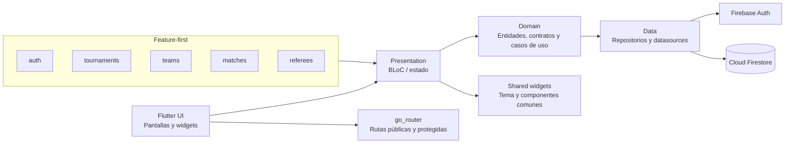
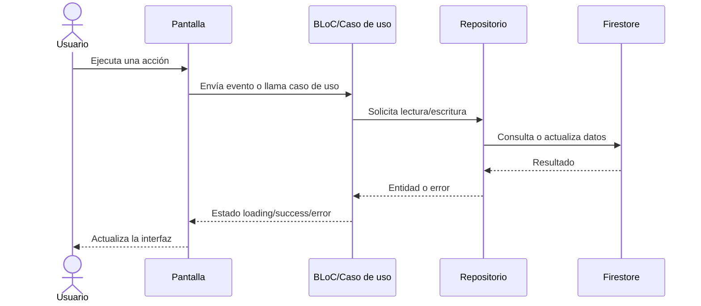

# Diagrama de arquitectura

## Objetivo

Handplay es una aplicación Flutter organizada por funcionalidades y capas, con Firebase como plataforma de autenticación y persistencia.

## Capas

| Capa | Responsabilidad |
| --- | --- |
| `presentation` | Renderiza pantallas, formularios y estados de interacción. |
| `domain` | Define modelos, reglas y contratos independientes de Firebase. |
| `data` | Implementa repositorios, consultas, escrituras y transformación de datos. |
| `shared` | Reúne tema, navegación, componentes y utilidades reutilizables. |

## Flujo de una operación

## Decisiones técnicas

- Firebase Auth gestiona identidad y sesiones.
- Firestore conserva torneos, inscripciones, equipos, partidos, perfiles y clubes.
- Las reglas de Firestore complementan las validaciones de la interfaz.
- Las rutas protegidas dependen de sesión y roles.
- Los cruces de fase 2 se mantienen como una decisión manual del administrador.
