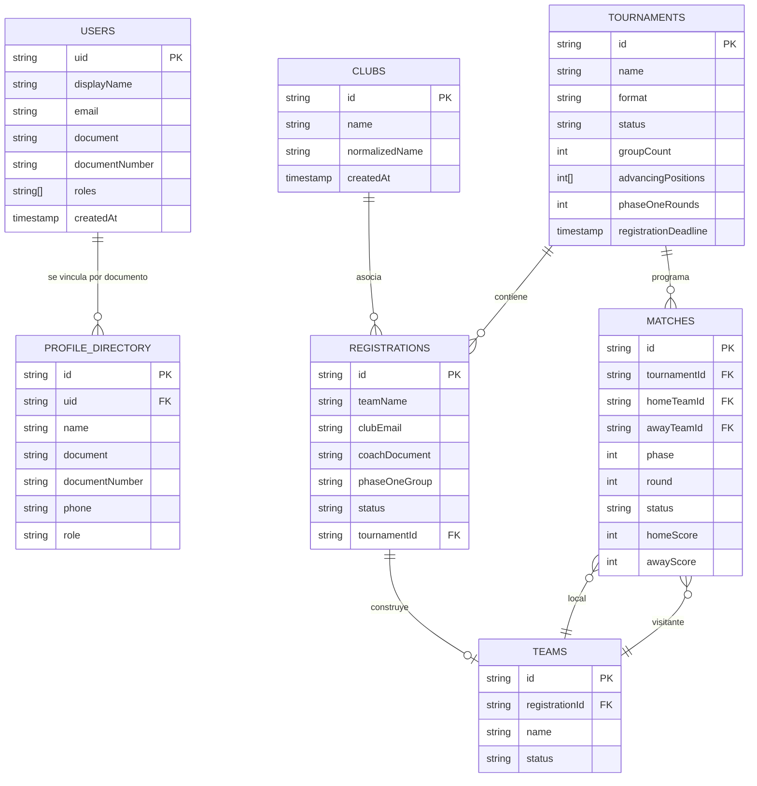
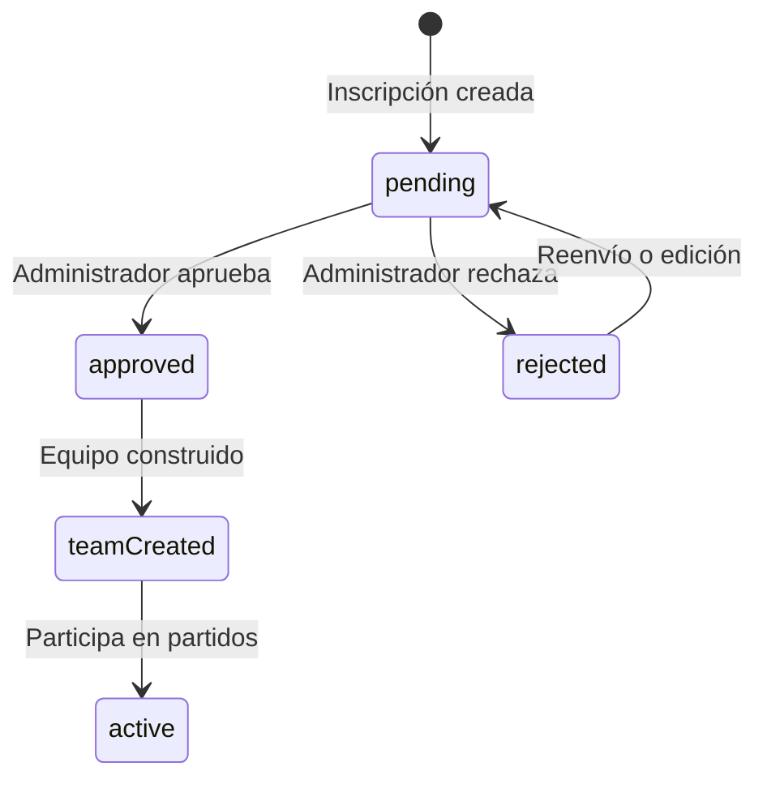

# Diagrama de base de datos

## Modelo lógico Firestore

Firestore utiliza una colección principal de torneos con subcolecciones operativas. Los perfiles globales se mantienen en `users` y `profile_directory` para permitir vinculación por documento incluso cuando una inscripción no solicita correo.



## Rutas Firestore

```text
users/{uid}
users/club_{emailKey}  (usuario de club creado al inscribir)
clubs/{clubId}          (email, coachName, coachDocument, coachEmail, assistantName, assistantDocument, assistantEmail)
users/club_{emailKey}   (usuario Firestore asociado al correo del club)
profile_directory/{profileId}
clubs/{clubId}
tournaments/{tournamentId}
tournaments/{tournamentId}/registrations/{registrationId}
tournaments/{tournamentId}/teams/{registrationId}
tournaments/{tournamentId}/matches/{matchId}  (jornada, leg: ida|vuelta, homeTeamId, awayTeamId)
```

## Estados principales



## Integridad y seguridad

- `document` y `documentNumber` permiten localizar perfiles existentes.
- `clubEmail` identifica al correo institucional del club, no al entrenador.
- Las estadísticas se calculan con inscripciones y partidos aprobados/finalizados.
- Los partidos y planillas respetan roles y permisos de Firebase.
- Un registro pendiente no debe alimentar tablas públicas de posiciones.
