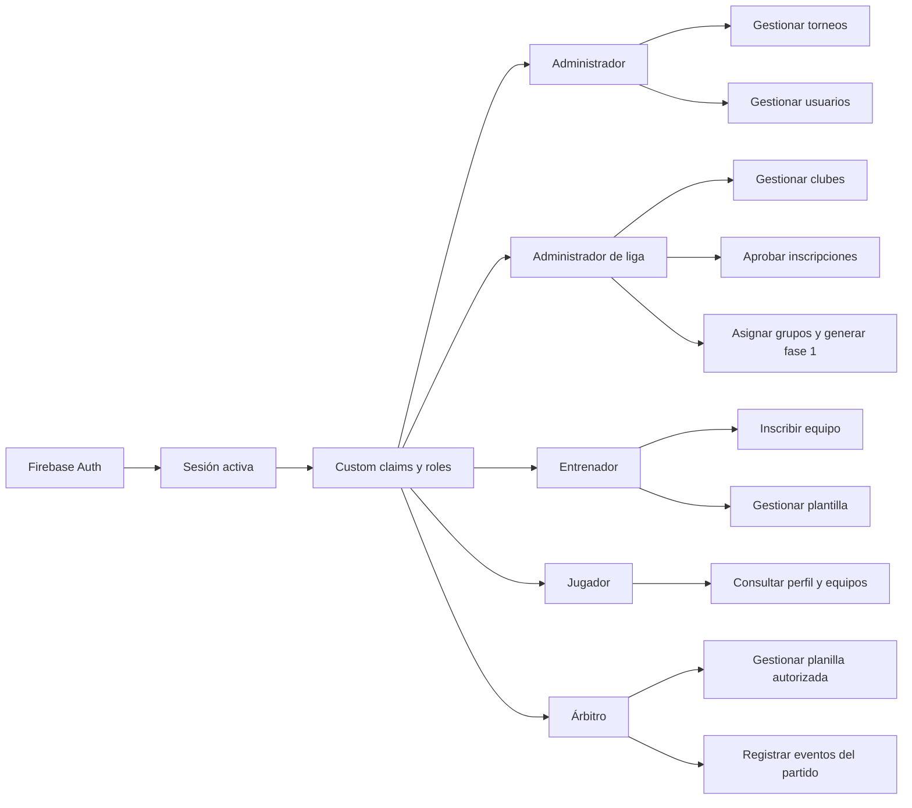

# Diagrama de roles y permisos

## Matriz de autorización

| Capacidad | Admin | Admin liga | Entrenador | Jugador | Árbitro |
| --- | :---: | :---: | :---: | :---: | :---: |
| Consultar información pública | Sí | Sí | Sí | Sí | Sí |
| Crear y editar torneos | Sí | Sí | No | No | No |
| Gestionar clubes | Sí | Sí | No | No | No |
| Aprobar inscripciones | Sí | Sí | No | No | No |
| Inscribir equipo | Sí | Sí | Sí | No | No |
| Administrar plantilla propia | No | No | Sí | No | No |
| Registrar partido en vivo | No | No | No | No | Sí |
| Aprobar y bloquear planilla | Sí | Sí | No | No | Sí |
| Crear cruces de fase 2 | Sí | Sí | No | No | No |

La matriz es una guía funcional; la autorización definitiva se aplica en la ruta, el servicio y las reglas de Firestore.
