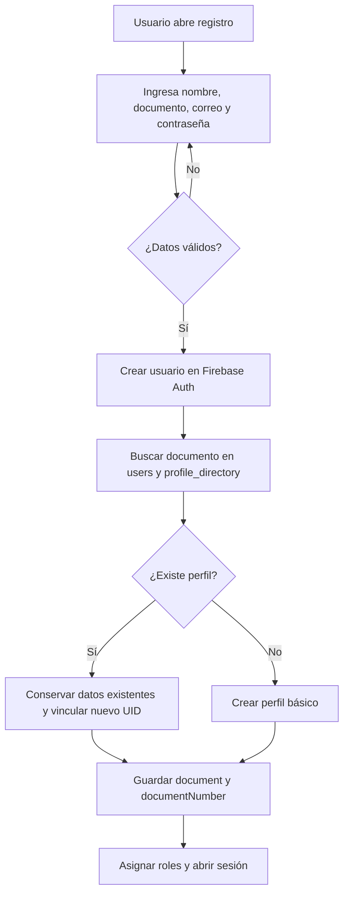
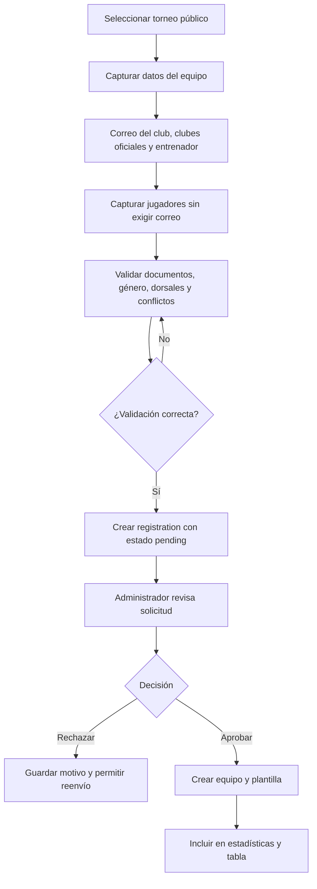
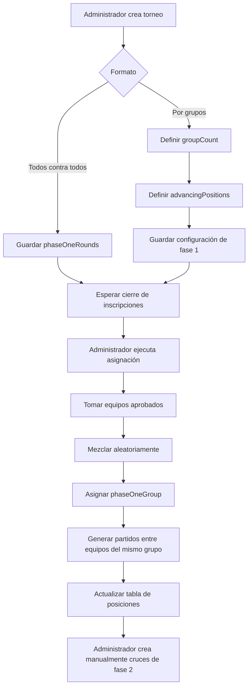
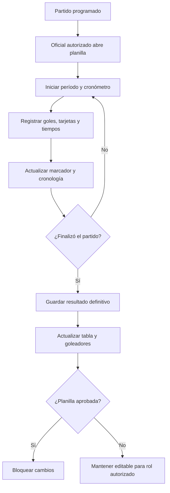

# Diagramas de flujo

## Autenticación y vinculación por documento

```mermaid
flowchart TD
  A[Usuario abre registro] --> B[Ingresa nombre, documento, correo y contraseña]
  B --> C{¿Datos válidos?}
  C -- No --> B
  C -- Sí --> D[Crear usuario en Firebase Auth]
  D --> E[Buscar documento en users y profile_directory]
  E --> F{¿Existe perfil?}
  F -- Sí --> G[Conservar datos existentes y vincular nuevo UID]
  F -- No --> H[Crear perfil básico]
  G --> I[Guardar document y documentNumber]
  H --> I
  I --> J[Asignar roles y abrir sesión]
```

## Inscripción y aprobación de equipos

```mermaid
flowchart TD
  A[Seleccionar torneo público] --> B[Capturar datos del equipo]
  B --> C[Correo del club, clubes oficiales y entrenador]
  C --> D[Capturar jugadores sin exigir correo]
  D --> E[Validar documentos, género, dorsales y conflictos]
  E --> F{¿Validación correcta?}
  F -- No --> E
  F -- Sí --> G[Crear registration con estado pending]
  G --> H[Administrador revisa solicitud]
  H --> I{Decisión}
  I -- Rechazar --> J[Guardar motivo y permitir reenvío]
  I -- Aprobar --> K[Crear equipo y plantilla]
  K --> L[Incluir en estadísticas y tabla]
```

## Creación de torneo y fase 1

```mermaid
flowchart TD
  A[Administrador crea torneo] --> B{Formato}
  B -- Todos contra todos --> C[Guardar phaseOneRounds]
  B -- Por grupos --> D[Definir groupCount]
  D --> E[Definir advancingPositions]
  E --> F[Guardar configuración de fase 1]
  C --> G[Esperar cierre de inscripciones]
  F --> G
  G --> H[Administrador ejecuta asignación]
  H --> I[Tomar equipos aprobados]
  I --> J[Mezclar aleatoriamente]
  J --> K[Asignar phaseOneGroup]
  K --> L[Generar partidos entre equipos del mismo grupo]
  L --> M[Actualizar tabla de posiciones]
  M --> N[Administrador crea manualmente cruces de fase 2]
```

## Partido en vivo

```mermaid
flowchart TD
  A[Partido programado] --> B[Oficial autorizado abre planilla]
  B --> C[Iniciar período y cronómetro]
  C --> D[Registrar goles, tarjetas y tiempos]
  D --> E[Actualizar marcador y cronología]
  E --> F{¿Finalizó el partido?}
  F -- No --> C
  F -- Sí --> G[Guardar resultado definitivo]
  G --> H[Actualizar tabla y goleadores]
  H --> I{¿Planilla aprobada?}
  I -- Sí --> J[Bloquear cambios]
  I -- No --> K[Mantener editable para rol autorizado]
```
